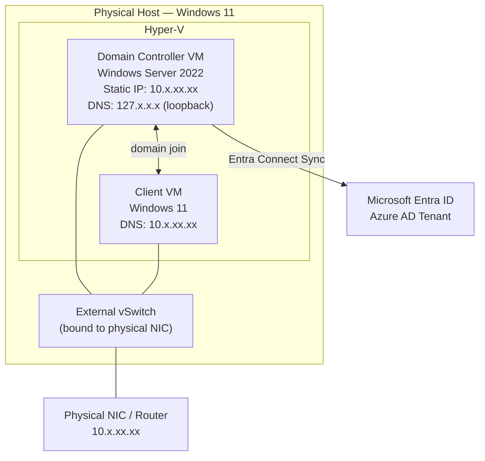

[README.md](https://github.com/user-attachments/files/32249178/README.md)

# TrueBloodLabEAAD 


Entra Azure Active Directory Lab made fun with True Blood characters.
# 🩸 True Blood Lab — Hyper-V AD DC + Microsoft Entra Connect Sync

A home-lab build of a hybrid identity environment: a Hyper-V–hosted Active Directory domain controller synced to Microsoft Entra ID (Azure AD) via Entra Connect Sync. This repo documents the full build — including the networking and DNS failures that had to be diagnosed and fixed along the way.

> Built as hands-on practice while studying for Security+, this lab covers the core hybrid-identity stack most orgs run: on-prem AD DS, Hyper-V virtual networking, and cloud directory sync.

---

## Why this is here

Anyone can follow a "click Next five times" AD tutorial. This repo is the opposite — it's the troubleshooting log from a build that broke in three different ways before it worked, with the root cause and fix for each. If you're learning Hyper-V/AD/Entra, the [failure log](#failed-attempts) is probably more useful than the success screenshot. I just wanted to learn how devices and people are added to Entra from AD. Here are a few of my MANY trial and errors.
## Architecture



## Environment

| Component | Value |
|---|---|
| Hypervisor | Hyper-V on Windows 11 |
| Domain Controller | Windows Server 2022 |
| Domain | `<lab-domain>.local` |
| Client VM | Windows 11, domain-joined |
| Identity Sync | Microsoft Entra Connect Sync |
| Target Tenant | Microsoft Entra ID (Azure AD) |

*(Hostnames and tenant name in the original notes have been genericized here — see [note on this repo's screenshots](#-note-before-you-publish-this) if you're adapting this.)*

## The build, in order

1. **Create an External Hyper-V vSwitch** bound to a physical NIC, not the Default Switch.
2. **Assign the DC a static IP** on the same subnet as everything else.
3. **Point the DC's own DNS to `127.x.x.x`** so it resolves its own AD-integrated zone.
4. **Disable DHCP** on the DC's NIC.
5. **Point the client VM's DNS at the DC's IP**, not the router.
6. **Verify with `nslookup`** that the domain and its SRV records resolve.
7. **Join the client to the domain.**
8. **Run Entra Connect Sync**, pointing it at the on-prem forest.
9. **Trigger and verify the sync cycle** with PowerShell.

## Failed attempts

Every one of these traces back to one of two root causes: **the DC wasn't on a routable IP**, or **DNS wasn't pointed at the DC itself**.

| # | What was tried | Why it failed |
|---|---|---|
| 1 | Left DC on the Default Switch | Default Switch is NAT-only — it hands out non-routable `172.x` addresses, invisible to other VMs |
| 2 | Bridged the host NIC instead | Bridging conflicted with the host's own network stack — caused IP conflicts, had to be removed |
| 3 | Created an External switch on the primary NIC | Adapter was already claimed by another vSwitch — `"already bound to the Microsoft Virtual Switch protocol"` |
| 4 | Set DC DNS to the ISP's resolvers | ISP DNS doesn't host the lab's AD zone — SRV record lookups failed, domain join failed |
| 5 | Set DC DNS to the router | Same problem — the router isn't authoritative for the AD zone either |
| 6 | Manually assigned a static IP, left DNS wrong | Right subnet, still no AD zone resolution — domain join still failed |
| 7 | Ran the **AD LDS** Setup Wizard | Wrong product entirely — AD Lightweight Directory Services is a standalone LDAP instance, not a full AD DS domain controller. Entra Connect needs AD DS |
| 8 | Ran Entra Connect's "Connect Directories" step early | `"The domain specified in the credentials does not exist or cannot be contacted"` — the DC's network wasn't stable yet |

### What actually fixed it

The fix was **not** one setting — it was recognizing that Hyper-V networking, static IP assignment, and DNS all had to be correct *together* before AD (and therefore Entra Connect) would work at all:

- External vSwitch → routable subnet
- DC DNS → loopback (`127.x.x.x`), so it's authoritative for its own zone
- Client DNS → the DC's IP, not the router

Once all three were true, `dcdiag`, `nslookup -type=SRV`, domain join, and Entra Connect Sync all succeeded on the first real attempt.

## Diagnostic commands used

```powershell
# Full network config on the DC
ipconfig /all

# Confirm the client can resolve the AD domain
nslookup <lab-domain>.local

# Confirm AD SRV records are published (hard requirement for domain join)
nslookup -type=SRV _ldap._tcp.<lab-domain>.local

# Force DNS re-registration after IP/DNS changes
ipconfig /flushdns
ipconfig /registerdns

# Confirm core AD services are running
Get-Service adws, dns, kdc, netlogon | Select Name, Status

# DNS-specific domain controller diagnostics
dcdiag /test:dns

# Confirm outbound connectivity to Entra endpoints before configuring sync
Test-NetConnection login.microsoftonline.com -Port 443

# Trigger an Entra Connect sync cycle manually
Start-ADSyncSyncCycle -PolicyType Initial
```

## Lessons learned

- **Use an External vSwitch, not the Default Switch**, for anything that needs to be reachable from other VMs — Default Switch NAT addresses are dead ends.
- **A domain controller's DNS should point to itself (`127.x.x.x`)**, never to an ISP or router — this is the single most common home-lab AD failure.
- **Client VMs must use the DC as their DNS server.** Nothing else can resolve the AD zone.
- **Run `ipconfig /flushdns` and `/registerdns`** after any IP/DNS change so the DC republishes its records immediately.
- **Verify SRV records before attempting a domain join** — `nslookup -type=SRV _ldap._tcp.<domain>` failing means the join will fail too.
- **Delete network bridges before creating an External switch** on the same adapter — they conflict.
- **AD LDS ≠ AD DS.** Entra Connect Sync requires a real Active Directory Domain Services domain controller, not a lightweight directory instance.
- **Verify the on-prem UPN suffix in the Entra ID portal** after setup, or users can't SSO with on-prem credentials.
- **Test connectivity to `login.microsoftonline.com:443` from the DC** before configuring Entra Connect — if that fails, sync will too.


---

## Screenshots


